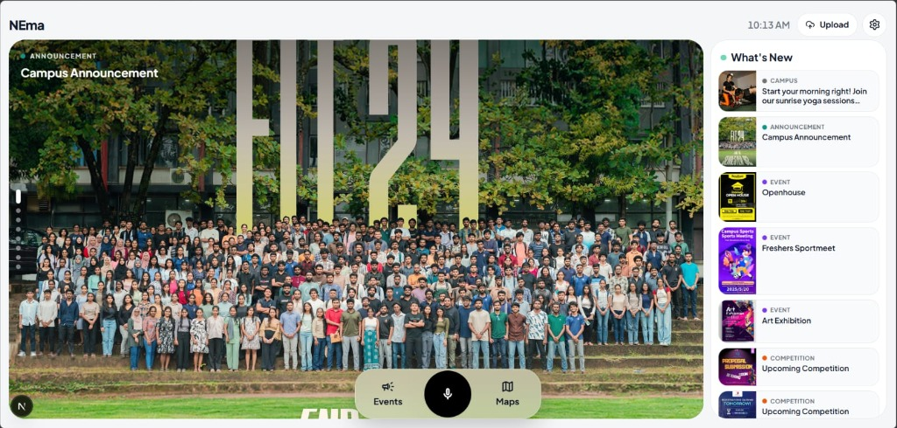
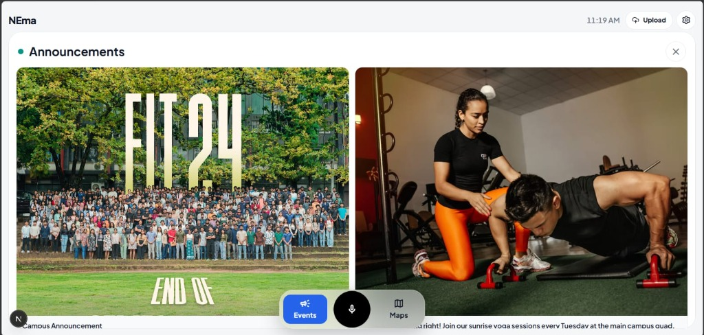
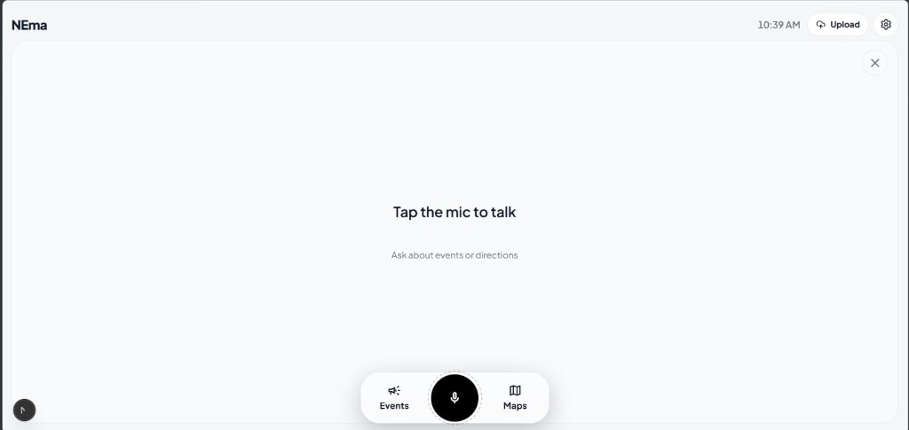
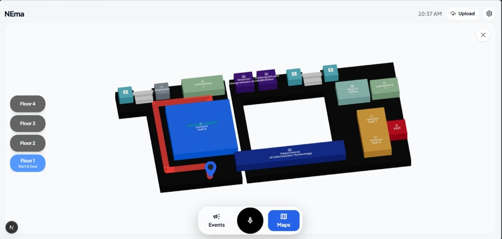
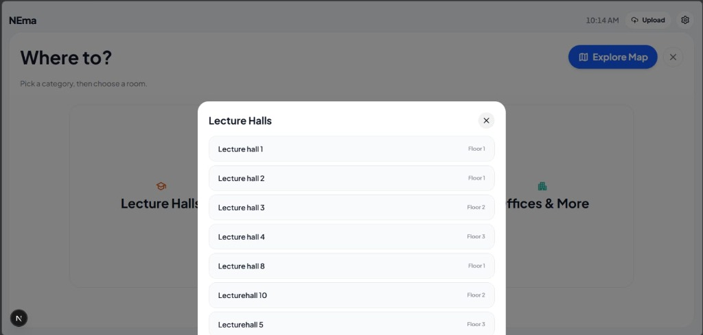

# Nema — Multimodal Autonomous Campus Kiosk Robot

Nema is an end-to-end autonomous campus kiosk robot featuring real-time computer vision, closed-loop kinematic motor positioning, dynamic eye animations, 4-DOF greeting gestures, and a zero-latency natural language voice agent interface.

---

## 📸 Kiosk User Interface Screenshots

### 1. Main Campus Announcement Hub

### 2. Events & Competitions Grid

### 3. Tap-to-Talk Interactive Voice Chat

### 4. Interactive 3D Campus Maps

### 5. Quick Destination & Faculty Navigation

---

## 📂 Quick Links & Documentation

- **🚀 [Quick Start & Setup Guide](docs/QUICK_START.md)** — Complete step-by-step instructions for fresh Raspberry Pi setup, config settings, and starting the kiosk stack.
- **🧠 [System Architecture & Specifications](docs/SYSTEM_ARCHITECTURE.md)** — Exhaustive technical details covering CPU core affinity, custom PCBs, Blackboard state bus, and NLU vector matching.
- **🎙️ [5-Minute Presentation Script](docs/INTRODUCTORY_SPEECH_5MIN.md)** — Presentation speech template in simple English, perfect for academic defense or demonstrations.
- **📦 [3D Printable STL Parts](hardware/3d_models/)** — 3D model files (.stl) for Nema's custom robot body and mounts.

---

## 🛠️ Hardware Stack Overview

- **Raspberry Pi 4 Model B (Brain):** Runs face-tracking, emotion engines, and the Next.js kiosk frontend.
- **ESP32 DevKit V1 (Muscles):** Controls servos (head pan/tilt, 4-DOF arms) and closed-loop DC base motors.
- **Raspberry Pi Zero 2 W (Voice Node):** Dedicated low-noise voice module running an INMP441 MEMS microphone.
- **3 Custom PCBs:** Custom circuit boards for the Pi 4 (eye screen outputs), ESP32 (motor control lines), and Pi Zero (mic module).
