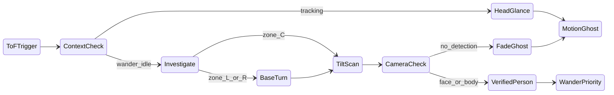

# ToF Proximity + Investigate System

This document describes how the robot reacts when the three VL53L0X time-of-flight (ToF) sensors detect someone approaching. It covers every behavioral case, what each subsystem does, and how the 3D debug map represents the result.

**Entry point:** `start_robot.py`  
**Config:** `config.yaml` → `proximity` and `proximity.investigate`

---

## Quick reference — what happens in each case

| Robot context | ToF zone | Base (chassis) | Head (neck) | Eyes / emotion | Floor map |
|---------------|----------|----------------|-------------|----------------|-----------|
| **Tracking face or body** | L | No turn — keeps tracking target | Quick glance left (~35° blend × 0.35) | `looking_left_natural` | Orange **M** motion ghost at world bearing |
| **Tracking face or body** | R | No turn | Quick glance right | `looking_right_natural` | Orange **M** ghost |
| **Tracking face or body** | C | No turn | Brief glance (minimal pan offset) | `attentive` | Orange **M** ghost |
| **Wander / idle** | L | Turn left ~35° | After turn: tilt sweep 2.5 s | Normal wander emotion | **M** ghost → fades or upgrades |
| **Wander / idle** | R | Turn right ~35° | After turn: tilt sweep | Normal wander emotion | Same |
| **Wander / idle** | C | No turn | Tilt sweep only (no base step) | Normal wander emotion | Same |
| **After scan — camera sees person** | any | May revisit verified spot in wander | — | — | **M** removed; yellow **P** (face) or blue **P** (body) |
| **After scan — no camera hit** | any | Resume wander | — | — | **M** ghost fades out over 5 s |
| **Wander + verified spot < 5 s old** | — | Small turn toward verified yaw (priority over random wander) | Another tilt scan after turn | — | Uses **P** marker, not **M** |
| **Voice session active (not tracking)** | L / R | No base turn | Head glance (legacy voice path) | Conversation emotion | No investigate FSM |
| **Investigate disabled** | L / R | Turn only | Old `prox_search` hold-center | — | No motion ghosts |

---

## End-to-end pipeline

```
ESP32 firmware (3× VL53L0X via TCA9548A)
        │  serial: PROX L/C/R velocity distance confidence
        ▼
hardware/arduino_servo.py  →  parses PROX lines (non-blocking)
        ▼
core/servo_mixer.py        →  writes prox_* fields to Blackboard
                             (L/R may be mirrored via swap_left_right)
        ├──────────────────────────────────────────┐
        ▼                                          ▼
core/base_controller.py    core/face_tracking.py
  • plans base turns         • records motion ghosts (MotionMemory)
  • starts investigate FSM   • verifies person on camera hit
  • wander revisit           • publishes motion_snapshots
        │                                          │
        ▼                                          ▼
core/servo_loop.py         core/emotion_engine.py
  • tilt scan during         • prox_glance_emotion override
    investigate              during track glance
  • head glance overlay
        │
        ▼
head_debug_viz.py (3D map)
  • orange M{id} motion ghosts (fading)
  • yellow/blue P{id} person memories (existing)
```

All modules share state through **`core/blackboard.py`**.

---

## Sensing layer

### Hardware

- Three VL53L0X sensors: **Left**, **Center**, **Right** on a TCA9548A I²C mux.
- ESP32 firmware streams `PROX` events when approach velocity and confidence thresholds are met.
- `proximity.swap_left_right: true` in config mirrors L/R in Python when physical wiring does not match labels.

### Blackboard fields (written by ServoMixer)

| Field | Meaning |
|-------|---------|
| `prox_approach_active` | Valid approach event in progress |
| `prox_approach_zone` | `"L"`, `"C"`, or `"R"` |
| `prox_approach_velocity` | mm/s (negative = approaching) |
| `prox_approach_distance` | mm |
| `prox_approach_confidence` | Consecutive confirm frames from firmware |
| `prox_approach_ts` | Timestamp of last PROX event (dedup key) |
| `prox_zone_left/center/right` | Lingering presence (not approach) |
| `prox_post_turn_lockout_ts` | Ignore new reactions until this time |

### Gating — when a PROX event is **ignored**

`BaseController._plan_proximity_step` will not react if any of these are true:

- `proximity.enabled` is false
- `prox_approach_active` is false
- Same `prox_approach_ts` already reacted to (one reaction per event)
- Inside post-turn lockout window
- Within `post_motion_blanking_sec` after any base motion finished
- Within `cooldown_sec` since last prox reaction
- `prox_approach_confidence` < `min_confidence` (default 3)
- More than `max_turns_per_window` turns in `turn_window_sec`

---

## Case 1 — Tracking face or body + ToF approach

**When:** `face_detected` or `body_detected` is true, and `proximity.investigate.enabled` is true.

### Base

- **No base turn.** Tracking target is preserved.
- `_plan_proximity_step` returns no step; calls `_trigger_prox_glance` instead.

### Head (`servo_loop._tick_track`)

- `prox_glance_active` overlay runs alongside normal tracking PID.
- **Toward phase** (~0.8 s): pan blends toward `prox_glance_target_pan`.
  - L: pan offset = `+turn_step_deg × glance_blend_track` (default 35° × 0.35)
  - R: pan offset = negative of that
  - C: no meaningful offset
- **Return phase** (~0.6 s): glance ends; tracking resumes full control.
- While tracking, blend is capped at `glance_blend_track` (weaker peek so track is not disrupted).

### Emotion (`emotion_engine.py`)

- While `prox_glance_active` and `prox_glance_emotion` is set:
  - L → `looking_left_natural`
  - R → `looking_right_natural`
  - C → `attentive`
- Overrides normal surroundings emotion for the glance duration.

### Map (`face_tracking._record_prox_motion`)

- Creates or updates a **motion ghost** in `MotionMemory`.
- World bearing: `base_world_yaw_deg + zone_offset` (L ≈ −35°, C = 0°, R ≈ +35°).
- Published as `motion_snapshots` → 3D viz shows orange pulsing **M{id}** on the floor arc.

---

## Case 2 — Wander / idle + ToF approach from the **left** or **right**

**When:** No face/body track, not in voice-session glance path, zone is L or R.

### Base (`base_controller`)

1. Plans a base step: `±turn_step_deg` (default 35°) toward the zone.
2. Applies neck compensation (`compensation_gain`) so gaze stays roughly forward during turn.
3. Calls `_start_investigate(..., phase="turn")`.
4. Sets post-turn lockout.

### Investigate FSM phases

| Phase | Who advances it | What happens |
|-------|-----------------|--------------|
| `"turn"` | Base motion completes → phase becomes `"scan"` | Head holds pan center + level tilt while base rotates |
| `"scan"` | `servo_loop._tick_prox_investigate` (~2.5 s) | Tilt sweep: center → down (12°) → up (8°) → center |
| `"done"` | Scan timer expires | Investigate cleared; fade signal sent |

### Head during scan

- Pan held at center (body already aimed for L/R).
- Tilt animates over `scan_duration_sec` (default 2.5 s).
- If face or body appears during scan → investigate cleared immediately (verify path runs).

### Map

- Motion ghost recorded at computed world bearing (same as Case 1).
- Outcome depends on camera (Cases 4 and 5 below).

---

## Case 3 — Wander / idle + ToF approach from **center**

**When:** No track, zone is C, investigate enabled.

### Base

- **No base turn.** `_start_investigate(..., phase="scan")` immediately.

### Head

- Goes straight into tilt sweep (same as scan phase in Case 2).

### Map

- Motion ghost at `base_world_yaw_deg` (no lateral offset).

---

## Case 4 — Investigate ends + **camera confirms** person

**When:** During investigate (`phase` is `turn`, `scan`, or `done`) and `face_detected` or `body_detected`.

### Person memory (`lib/person_memory.py`)

- New observation with `source="prox_verify"`.
- **Shorter TTL:** `verified_ttl_sec` (default 5 s), not the normal 20 s person timeout.
- Face: full `observe()` with norm x/y and pan.
- Body only: `observe_at_yaw()` at `prox_investigate_yaw`.

### Motion memory

- Linked ghost marked `verified=True` → removed from viz snapshots.
- Person appears as existing **P{id}** marker (yellow face / blue body).

### Wander priority

- `prox_verified_priority_yaw` published on blackboard.
- In wander mode, `_plan_prox_verified_revisit` runs **before** random wander turns:
  - Only if verified person age < `revisit_max_age_sec` (5 s).
  - Only if current aim is more than `revisit_aim_tolerance_deg` (15°) off target.
  - Plans a small base step, then starts investigate again (`phase="turn"` → scan).
- **Unverified motion ghosts never drive wander turns** (by design).

---

## Case 5 — Investigate ends + **no camera hit**

**When:** Scan timer completes without face/body detection.

### Sequence

1. `servo_loop` sets `prox_investigate_active=False`, `prox_investigate_phase="done"`, `prox_scan_complete_ts=now`.
2. `face_tracking._handle_prox_verify` sees new `prox_scan_complete_ts`.
3. Calls `motion_memory.start_fade(motion_id)` for the linked ghost.

### Map

- Orange **M{id}** remains on floor.
- `freshness` decays from 1 → 0 over `motion_fade_sec` (default 5 s).
- Pulsing ring opacity follows freshness.
- Ghost pruned when freshness hits 0.

---

## Case 6 — Voice session active (not tracking)

**When:** `voice_session_active` and not currently tracking face/body.

- L/R approach triggers a **head glance only** (older voice path).
- Uses `glance_blend` (0.4), not `glance_blend_track`.
- No investigate FSM, no motion ghost requirement from this path alone (ghost still recorded if a separate valid PROX event fires while not gated).

---

## Case 7 — Investigate **disabled**

**When:** `proximity.investigate.enabled: false`.

- L/R wander still gets base turn.
- Legacy `prox_search_active` hold-center behavior instead of tilt sweep.
- No `MotionMemory` / orange ghosts (FaceTracker skips motion memory init).

---

## Memory types

### Motion ghosts (`lib/motion_memory.py`)

Short-lived **unverified** ToF cues. Separate from person memory.

| Field | Purpose |
|-------|---------|
| `id` | Shown as M{id} on viz |
| `world_yaw_deg` | Floor position on 1.2 m arc |
| `zone` | L / C / R |
| `distance_mm` | Last ToF distance |
| `fade_start_ts` | When 5 s fade began |
| `verified` | True after camera confirm → hidden |

### Person memory (`lib/person_memory.py`)

Camera-anchored people on the floor map.

| Source | TTL | Drives wander? |
|--------|-----|----------------|
| `"camera"` | `person_memory.timeout_sec` (20 s) | Via existing memory follow |
| `"prox_verify"` | `verified_ttl_sec` (5 s) | Yes — `_plan_prox_verified_revisit` |

---

## 3D debug visualization

**File:** `head_debug_viz.py`  
**Data path:** `debug_dashboard.py` → `/api/state`

| Marker | Color | Label | When |
|--------|-------|-------|------|
| Motion ghost | Orange `#f97316` | `M{id}` | Unverified ToF approach; opacity = freshness |
| Person (face) | Yellow | `P{id}` | Camera or prox_verify face |
| Person (body) | Blue | `P{id}` | Camera or prox_verify body |
| ToF beams | Cyan / orange | L/C/R HUD | Live presence + approach |

Legend includes **“ToF motion (fading)”**. Prox HUD shows APPROACH, INVESTIGATE (phase), GLANCING, or clear.

---

## Blackboard investigate fields

| Field | Values | Set by |
|-------|--------|--------|
| `prox_investigate_active` | bool | base_controller, servo_loop, face_tracking |
| `prox_investigate_phase` | `""` \| `"turn"` \| `"scan"` \| `"done"` | base_controller, servo_loop |
| `prox_investigate_zone` | L / C / R | base_controller |
| `prox_investigate_yaw` | degrees | base_controller |
| `prox_investigate_since` | timestamp | base_controller (reset on phase → scan) |
| `prox_investigate_motion_id` | int | face_tracking |
| `prox_verified_priority_yaw` | float \| None | face_tracking |
| `prox_scan_complete_ts` | float | servo_loop (fade trigger) |
| `prox_glance_emotion` | emotion name | base_controller |
| `motion_snapshots` | list[dict] | face_tracking |

---

## Config reference

```yaml
proximity:
  enabled: true
  swap_left_right: true          # mirror L/R if wiring ≠ labels
  min_confidence: 3
  turn_step_deg: 35.0
  cooldown_sec: 5.0
  post_turn_lockout_sec: 2.0
  post_motion_blanking_sec: 1.5
  glance_toward_sec: 0.8
  glance_return_sec: 0.6
  glance_blend: 0.4              # voice-session glance strength

  investigate:
    enabled: true
    motion_fade_sec: 5.0         # M-marker fade duration
    verified_ttl_sec: 5.0        # P-marker from prox_verify
    scan_duration_sec: 2.5
    scan_tilt_down_deg: 12.0
    scan_tilt_up_deg: 8.0
    zone_yaw_deg: 35.0           # L/R bearing offset from body forward
    glance_blend_track: 0.35     # head peek strength while tracking
    revisit_enabled: true
    revisit_max_age_sec: 5.0
    revisit_aim_tolerance_deg: 15.0
```

---

## State diagram



---

## Priority order in wander mode (base_controller)

When `servo_mode == "wander"` and base is idle:

1. **Prox verified revisit** — aim at `prox_verified_priority_yaw` if fresh
2. Wander follow (existing)
3. Sustained hold follow
4. **New prox approach** — turn + investigate or center scan
5. Random wander turns (lowest)

---

## Key source files

| File | Role |
|------|------|
| `hardware/arduino_servo.py` | PROX serial parsing, ToF mute during base motion |
| `core/servo_mixer.py` | Blackboard prox fields, L/R swap |
| `core/base_controller.py` | Context routing, turns, revisit, investigate start |
| `core/servo_loop.py` | Glance overlay, tilt scan FSM |
| `core/face_tracking.py` | Motion ghosts, camera verify, snapshots |
| `core/emotion_engine.py` | Glance emotion override |
| `lib/motion_memory.py` | ToF ghost store + fade |
| `lib/person_memory.py` | Person store + `prox_verify` TTL |
| `lib/prox_investigate.py` | Zone → world yaw, glance emotion helpers |
| `head_debug_viz.py` | M and P floor markers, prox HUD |
| `core/debug_dashboard.py` | API snapshot for viz |

---

## Manual test checklist

1. **Wander + R approach** — base turns right → tilt sweep → no face → orange M fades over 5 s  
2. **Wander + approach + person in frame** — M upgrades to P; wander revisits within 5 s  
3. **Track + L approach** — no base move; head glances left; emotion shifts; track unchanged  
4. **Center approach idle** — no base turn; tilt sweep only  
5. **3D viz** — M icons on correct side; verified persons use P markers  

---

## Out of scope (current build)

- Firmware zone label changes (use `swap_left_right` in config instead)
- Patrolling all motion ghosts — only **verified** spots get wander revisit
- Multi-ghost queue / patrol route
