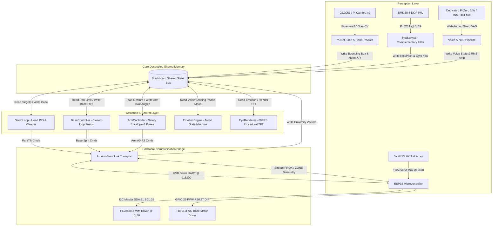
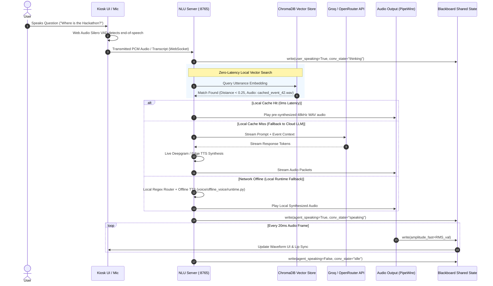

# Voice Agent V5 — System Architecture & Technical Specification

**Project Title:** Voice Agent V5: Multimodal Autonomous Kiosk Robot  
**Document Version:** 5.4.0  
**Target Audience:** University Dean, Academic Evaluation Committee, Systems Architecture & Robotics Engineering Team  
**Author / Engineering Lead:** Voice Agent V5 Project Team  
**Date:** August 2026  

---

## 📋 Executive Summary & System Overview

**Voice Agent V5** is an integrated, end-to-end multimodal autonomous kiosk and physical robotic head/arm platform. Designed for high-foot-traffic campus environments, the system combines real-time computer vision, closed-loop kinematic motion control, sensor fusion, natural language understanding (NLU), and procedural graphics to deliver zero-latency human-robot interactions (HRI).

### Key Architectural Highlights
1. **Multimodal Perception Array:** Computer vision via OpenCV YuNet neural face detection, Bosch BMI160 6-DOF head IMU stabilization, and 3-zone ST VL53L0X Time-of-Flight (ToF) laser ranging via a TCA9548A I2C multiplexer.
2. **Centralized Shared-Memory Blackboard Architecture:** Decoupled thread-safe state bus (`core/blackboard.py`) using lock-free read concepts and CPU-friendly condition variables (`wait_for`) to eliminate polling latency while running at 0% idle CPU overhead.
3. **Distributed Hardware Controller Bridge:** Dedicated ESP32 NodeMCU microcontroller managing physical actuators (head pan/tilt, 4-DOF robotic arms, TB6612FNG motor driver base spin) via high-speed custom binary/ASCII serial wire protocol over USB UART.
4. **Zero-Latency NLU & Pre-Synthesized Speech Pipeline:** Local ChromaDB vector database with pre-synthesized 48kHz uncompressed audio cache combined with online LLM (Groq/OpenRouter) and offline local fallback runtime.
5. **Interactive Touchscreen Kiosk UI:** Next.js 14 React frontend rendering event posters, interactive maps, live voice waveforms, and real-time face greeting overlays.



---

## 💻 Multiprocessing CPU Core Affinity & Allocation Strategy

To ensure zero micro-stutters in 48kHz audio playback while running compute-intensive neural vision inference, process scheduling on the Raspberry Pi 4 Model B (Quad-Core ARM Cortex-A72 @ 2.1 GHz) is explicitly pinned using `taskset -c 0-2 nice -n -5`:

```
+---------------------------------------------------------------------------------------------------+
|                                  Raspberry Pi 4 Quad-Core Allocation                              |
+-------------------+-----------------------+-----------------------+-------------------------------+
|    CPU Core 0     |      CPU Core 1       |      CPU Core 2       |          CPU Core 3           |
| (OS & Media Core) |    (Vision Core)      |   (Kinematics Core)   |        (NLU & Web Core)       |
+-------------------+-----------------------+-----------------------+-------------------------------+
| - Linux OS Kernel | - YuNet Neural Model  | - ServoLoop (PID Head | - Next.js Kiosk UI (:3000)    |
| - ALSA / PipeWire |   Face Tracker        |   Tracking @ 35-50Hz) | - Local NLU Server (:8765)    |
|   48kHz Audio     | - PyCamera2 Sensor    | - BaseController      | - ChromaDB Vector Store       |
| - Chromium Kiosk  |   Capture Feed        |   (Encoder+IMU Fusion)| - Python MediaServer (:8080)  |
|   Browser Engine  | - Skin-blob & Hand    | - ImuService & Arm    | - LiveKit WebRTC Agent        |
|   GPU Driver      |   Gesture Processing  |   Safety Envelope     |   Worker                      |
+-------------------+-----------------------+-----------------------+-------------------------------+
```

### Core Assignment Table

| Core ID | Assigned Processes / Threads | Priority (`nice`) | Rationale |
| :--- | :--- | :--- | :--- |
| **Core 0** | OS Kernel, PipeWire / ALSA Audio Engine, Chromium Kiosk Browser | `nice = 0` | Dedicated to real-time audio playback, USB I/O, and hardware-accelerated WebGL display rendering. |
| **Core 1** | OpenCV YuNet Face Detection (`core/face_tracking.py`), PyCamera2 | `nice = -5` | Isolated high-throughput matrix operations for neural computer vision inference without interfering with audio. |
| **Core 2** | `ServoLoop` (PID), `BaseController` (Fusion), `ArmController`, `ImuService` | `nice = -5` | High-frequency deterministic kinematic control loops ($35-50\text{ Hz}$) ensuring smooth servo movement. |
| **Core 3** | Next.js Server (:3000), NLU WS Server (:8765), ChromaDB, MediaServer (:8080) | `nice = 0` | Handles asynchronous network HTTP/WebSocket requests, vector embeddings, and LLM API streaming. |

---

## 🛠️ Complete Hardware Component Architecture & Specifications

The robot utilizes a heterogeneous, multi-bus hardware topology separating high-level neural inference from microsecond-level deterministic pulse-width modulation (PWM) and quadrature interrupt counting.

```
+---------------------------------------------------------------------------------------------------+
|                                   Raspberry Pi 4 Model B (Host Node)                             |
|  - ARM Cortex-A72 Quad-Core @ 2.1 GHz (Overclocked) | 8GB LPDDR4 SDRAM                            |
|  - VideoCore VI GPU | 256MB CMA Allocation | Raspberry Pi OS 64-bit Bookworm (Kernel 6.6)         |
+-------------------+---------------------------------------+---------------------------------------+
                    |                                       |
                    | USB Serial UART (115200 Baud)         | Hardware I2C 1 (SDA: GPIO2 / SCL: GPIO3)
                    v                                       v
+---------------------------------------------------+   +-------------------------------------------+
|             ESP32 Microcontroller                 |   |       Bosch BMI160 6-DOF Head IMU         |
|  - Dual-Core Xtensa LX6 @ 240 MHz                 |   |  - Gyroscope (Z-yaw integration)          |
|  - FreeRTOS Real-Time Kernel                      |   |  - Accelerometer (Roll/Pitch leveling)    |
+---------+-----------------------+-----------------+   +-------------------------------------------+
          |                       |
          | I2C Master (21/22)    | GPIO 25 PWM / 26,27 DIR
          | @ 400 kHz             v
          |                     +-------------------------------------------------------------------+
          |                     |                 TB6612FNG / L298N Base Motor Driver               |
          |                     | - Drives High-Torque N20 Geared Base Motor                        |
          |                     | - Dual Optical Quadrature Encoders (GPIO35 / GPIO34 Interrupts)   |
          |                     +-------------------------------------------------------------------+
          |
          +-------------------------------------------+
          |                                           |
          v @ Address 0x70                            v @ Address 0x40
+-----------------------------------+   +-----------------------------------------------------------+
|   TCA9548A 8-Ch I2C Multiplexer   |   |            PCA9685 16-Ch 12-Bit PWM Servo Driver          |
| - Ch 0: ST VL53L0X ToF (Left)     |   | - Ch 4: Head Pan Servo (25° .. 150°)                      |
| - Ch 1: ST VL53L0X ToF (Center)   |   | - Ch 5: Head Tilt Servo (100° .. 150°)                    |
| - Ch 2: ST VL53L0X ToF (Right)    |   | - Ch 0: Arm Joint A0 (MG996R Shoulder Pitch)              |
+-----------------------------------+   | - Ch 2: Arm Joint A1 (MG996R Shoulder Roll)               |
                                        | - Ch 8: Arm Joint A2 (SG90 Elbow Flex)                    |
                                        | - Ch 9: Arm Joint A3 (SG90 Wrist Sweep)                   |
                                        +-----------------------------------------------------------+
```

### Exhaustive Hardware Bill of Materials & Pinout Specification

| Subsystem Component | Part Model / Specification | Bus / Interface | Pin Connections / I2C Addr | Operational Role |
| :--- | :--- | :--- | :--- | :--- |
| **Main Compute Host** | Raspberry Pi 4 Model B (8GB) | System Bus | Broadcom BCM2711 | Core AI engine, NLU server, YuNet vision, Next.js UI |
| **Secondary Compute** | Raspberry Pi Zero 2 W | USB / WiFi | ARM Cortex-A53 | Dedicated low-power audio mic / remote endpoint node |
| **Microcontroller** | ESP32 DevKit V1 (30-pin) | USB Serial UART | `/dev/ttyUSB0` @ 115200 | Real-time FreeRTOS task runner, PWM, interrupts, ToF |
| **I2C Multiplexer** | TCA9548A 8-Channel Mux | ESP32 I2C Master | `0x70` (SDA: 21, SCL: 22) | Resolves I2C address conflicts for 3x VL53L0X sensors |
| **Left ToF Sensor** | ST VL53L0X Laser Ranging | TCA9548A Ch 0 | I2C `0x29` via Mux Ch0 | Measures spatial distance in Left zone (80..2200 mm) |
| **Center ToF Sensor**| ST VL53L0X Laser Ranging | TCA9548A Ch 1 | I2C `0x29` via Mux Ch1 | Measures spatial distance in Center zone (80..2200 mm) |
| **Right ToF Sensor** | ST VL53L0X Laser Ranging | TCA9548A Ch 2 | I2C `0x29` via Mux Ch2 | Measures spatial distance in Right zone (80..2200 mm) |
| **PWM Servo Driver**| PCA9685 16-Ch 12-Bit PWM | ESP32 I2C Master | `0x40` (SDA: 21, SCL: 22) | Generates 50 Hz PWM signals for head and 4-DOF arms |
| **Head Pan Servo** | Digital High-Torque Servo | PCA9685 Ch 4 | Pulse: 450-2600 µs | Neck Horizontal Rotation (-90° to +90° sweep) |
| **Head Tilt Servo** | Digital High-Torque Servo | PCA9685 Ch 5 | Pulse: 450-2600 µs | Neck Vertical Pitch (-45° to +45° sweep) |
| **Arm Joint A0** | MG996R Metal Gear Servo | PCA9685 Ch 0 | Pulse: 450-2600 µs | Right Arm Shoulder Pitch ($47^\circ .. 124^\circ$) |
| **Arm Joint A1** | MG996R Metal Gear Servo | PCA9685 Ch 2 | Pulse: 450-2600 µs | Right Arm Shoulder Roll ($6^\circ .. 65^\circ$) |
| **Arm Joint A2** | SG90 Micro Servo | PCA9685 Ch 8 | Pulse: 1000-2000 µs | Right Arm Elbow Flex ($44^\circ .. 78^\circ$) |
| **Arm Joint A3** | SG90 Micro Servo | PCA9685 Ch 9 | Pulse: 1000-2000 µs | Right Arm Wrist Sweep ($70^\circ .. 102^\circ$) |
| **Base Motor Driver**| TB6612FNG / L298N H-Bridge | ESP32 GPIO | PWM: 25, AIN1: 26, AIN2: 27 | Drives N20 DC base geared spin motor (20 kHz PWM) |
| **Base Encoders** | Dual Optical Quadrature | ESP32 GPIO Interrupt | A: GPIO35, B: GPIO34 | Measures base rotation (31.167 counts/degree) |
| **Head IMU** | Bosch BMI160 6-DOF | Pi 4 Hardware I2C 1 | `0x69` (SDA: 2, SCL: 3) | 25 Hz Head horizon auto-leveling & body gyro yaw |
| **Camera Sensor** | GC2053 / Pi Camera v2 | CSI Ribbon Cable | MIPI CSI-2 Interface | 1080p video feed / 640x360 YuNet face detection |
| **MEMS Microphone** | INMP441 Omnidirectional | I2S Bus (Pi Zero 2 W)| SCK: 18, WS: 19, SD: 22 | 24-bit 48kHz I2S Digital MEMS Microphone |
| **Kiosk Touchscreen**| 10.1" 1024x600 IPS Display | HDMI 0 + USB Touch | HDMI 0 (Custom Timings) | Primary touchscreen kiosk display |
| **Eye TFT Displays** | Dual SPI 1.28" Round LCDs | Pi 4 SPI1 Bus | `dtoverlay=spi1-3cs` | 60 FPS Procedural TFT animated eye rendering |
| **Audio Interface** | USB External Sound Adapter | USB 2.0 / ALSA Card 3 | ALSA / PipeWire | Zero-resampling 48 kHz 16-bit uncompressed PCM I/O |

---

## 📡 Hardware Interconnection & Firmware ASCII Protocol Specification

The host Raspberry Pi 4 communicates with the ESP32 microcontroller running `firmware/head_servo_hands/head_servo_hands.ino` via USB Serial (`/dev/ttyUSB0` at 115,200 baud, 8N1).

```
Host (Raspberry Pi 4)                                     Embedded Controller (ESP32)
   |                                                                  |
   | --- Downstream Command: "P 12.5 T -4.0\n" -------------------->  | (Head Pan/Tilt target)
   | --- Downstream Command: "A0 47.0 A1 65.0 A2 64.0 A3 87.0\n" ->  | (Arm Joint Targets)
   | --- Downstream Command: "B -45.0\n" --------------------------->  | (Base Spin -45 deg)
   | --- Downstream Command: "AO\n" -------------------------------->  | (Detach Arm PWM Power)
   |                                                                  |
   |  <-- Upstream Ack: "OK P13 T-4\n" ----------------------------   | (Command Acknowledged)
   |  <-- Upstream Telemetry: "POS -1402 DEG -45.0 CPD 31.17 BUSY 0"  | (Base Odometry Update)
   |  <-- Upstream Event: "PROX A=L V=-120 D=450 C=3\n" -----------   | (Proximity Approach)
   |  <-- Upstream Matrix: "ZONE L=1 C=0 R=0\n" -------------------   | (Occupancy Matrix)
   |  <-- Upstream ToF Stream: "TOF L=840 C=1250 R=1800\n" --------   | (Raw Distance Stream)
```

### Downstream Wire Protocol (Pi → ESP32 Firmware)

| Command String | Parameters & Syntax | Firmware Execution (`head_servo_hands.ino`) |
| :--- | :--- | :--- |
| `P <pan> T <tilt>` | `pan`: [-90..+90], `tilt`: [-45..+45] | Writes pan/tilt servo angles to PCA9685 Channels 4 and 5. Quantized to 0.2° to prevent chatter. |
| `A0 <a0> A1 <a1> A2 <a2> A3 <a3>` | `a0..a3`: float joint degrees | Writes 4-DOF arm joint angles to PCA9685 Channels 0, 2, 8, 9. Resets idle detach timer (`ARM_IDLE_DETACH_MS = 30000`). |
| `AO` | None | Detaches arm servo PWM channels (0, 2, 8, 9) to stop SG90 micro-servo noise, buzz, and heating. |
| `B <deg>` | `deg`: float relative degrees | Initiates TB6612FNG motor base spin using closed-loop quadrature encoder interrupts (`ENC_A`, `ENC_B`). |
| `C <code>` | `code`: integer command | Calibration command (e.g. `C1` resets base encoder origin to 0). |
| `E <enable>` | `enable`: `0` or `1` | Motor safety gate: `0` disables TB6612FNG PWM output, `1` enables motor drivers. |
| `V` | None | Queries firmware banner version (e.g. `FW head_servo_hands_v5`). |

### Upstream Telemetry & Event Protocol (ESP32 Firmware → Pi)

| Packet Prefix | Exact Format & Regex Match | Firmware Logic & Source |
| :--- | :--- | :--- |
| **Servo Ack** | `OK P<pan> T<tilt>` | Emitted after PCA9685 register write confirmation. |
| **Base Status** | `POS <cnt> DEG <deg> CPD <cpd> BUSY <0|1>` | Emitted at 20 Hz during base motion. Contains raw quadrature encoder ticks and busy state. |
| **Proximity Approach**| `PROX A=<zone> V=<vel> D=<dist> C=<conf>` | Emitted when a person approaches. `zone` (`L`/`C`/`R`), approach velocity ($\text{mm/s}$), distance ($\text{mm}$), confidence. |
| **Proximity Depart**  | `PROX D=<zone> V=<vel> D=<dist> C=<conf>` | Emitted when a person leaves a zone. |
| **Occupancy Matrix**  | `ZONE L=<0|1> C=<0|1> R=<0|1>` | 3-Zone real-time presence occupancy state matrix. |
| **ToF Sensor Stream**  | `TOF L=<d0> C=<d1> R=<d2>` | 10 Hz raw distance stream from ST VL53L0X sensors via TCA9548A channel switching. |

---

## 🧠 The Shared-Memory Blackboard Architecture (`core/blackboard.py`)

At the core of Voice Agent V5 is a centralized, thread-safe, decoupled **Blackboard Shared Memory Bus**.

Instead of direct inter-thread coupling, data producers (Vision, IMU, Audio, ESP32 Serial) write state changes to the Blackboard. Data consumers (ServoLoop, BaseController, EmotionEngine, EyeRenderer, Next.js WS Server) read state atomically.

```
       PRODUCERS                                                 CONSUMERS
+--------------------+                                    +--------------------+
|  FaceTracker (AI)  | ----\                        /---> |  ServoLoop (PID)   |
+--------------------+      \                      /      +--------------------+
|   ImuService (IMU) | ----- \                    / ----> | BaseController     |
+--------------------+        \                  /        +--------------------+
| VoiceService (NLU) | -------> +----------------+ -----> | EmotionEngine      |
+--------------------+          |   BLACKBOARD   |        +--------------------+
|  ESP32 Serial Link | -------> | Shared Memory  | -----> | EyeRenderer (TFT)  |
+--------------------+        / +----------------+ \ ----> | ArmController      |
|  Proximity Engine  | ------/                      \ ---> | Next.js Kiosk UI   |
+--------------------+                                    +--------------------+
```

### Mutex Synchronization & Zero-CPU Event Notification

The Blackboard implements atomic `read()`, `write()`, and `wait_for()` primitives using `threading.Lock()` and mapped `threading.Condition()` variables:

1. **Atomic Read/Write (`read()`, `write()`):**
   ```python
   def write(self, **kwargs: Any) -> None:
       notified = []
       with self._lock:
           for key, value in kwargs.items():
               setattr(self, key, value)
               if key in self._conditions:
                   notified.append(self._conditions[key])
       # NOTIFY OUTSIDE LOCK TO PREVENT PRIORITY INVERSION
       for cond in notified:
           with cond:
               cond.notify_all()
   ```
2. **Zero-CPU Wait Primitive (`wait_for()`):**
   Subsystem threads (such as `BaseController` or `AnimationEngine`) call `bb.wait_for("field_name", timeout=5.0)`. Instead of burning CPU cycles in `while True: time.sleep(0.01)` polling loops, caller threads suspend at **0% CPU** until `bb.write()` emits a condition notification.

---

## ⚙️ Multi-Threaded Subsystem Execution & Control Logic

The Python backend starts several synchronized worker threads inside `start_robot.py`:

### 1. Vision Subsystem (`core/face_tracking.py`)
- **Neural Model:** OpenCV DNN with YuNet lightweight face detection (`face_detection_yunet_2023mar.onnx`).
- **Resolution Strategy:** Captures camera feed at 1080p for crisp display rendering, but downsamples to 640x360 for detection inference to conserve Pi CPU.
- **Adaptive Region of Interest (ROI):** Once a face is detected, the algorithm crops a bounding box sub-window (padded by 1.6x) for subsequent frames. Performs full-frame scans every 20 frames or upon target loss, cutting CPU usage by ~40%.
- **Zero-CPU Speech Pause Mode:** When `bb.read("user_speaking", "agent_speaking")` flags active audio, camera capture and YuNet inference pause automatically. This frees ~50ms/frame CPU capacity during voice synthesis.

### 2. Servo & Kinematics Control Loop (`core/servo_loop.py`)
- **Proportional-Integral-Derivative (PID) Control:** Translates normalized face coordinates ($x, y \in [-1.0, +1.0]$) into smooth head pan/tilt angle commands:
  $$\Delta \theta_{\text{pan}} = K_p \cdot e_x + K_d \cdot \frac{de_x}{dt}$$
- **Proactive Neck Counter-Rotation:** When the base spins to align with a user, the neck pan counter-rotates in exact opposition ($\text{Pan}_{\text{neck}} = -\theta_{\text{base}}$) to keep the camera locked on the user's face during body movement.
- **Wander & Search Generators:** When no target is detected for $>5.0$ seconds, the system enters an organic wandering state, gliding head pan/tilt angles using smooth S-curve interpolation.

### 3. Base Controller & Odometry Fusion (`core/base_controller.py` & `lib/yaw_home_tracker.py`)
- **Head-Lead Base Alignment:** If the head pan angle exceeds $\pm 12.0^\circ$ relative to the central body chassis, the `BaseController` commands a base spin step to align the body with the head.
- **Sensor Fusion:** Merges relative quadrature encoder counts ($31.167\text{ counts/degree}$) with the BMI160 gyro integrated $Z$-yaw. If physical base wheel slip occurs, the IMU gyro overrides encoder odometry to guarantee accurate orientation tracking.

### 4. IMU Head Horizon & Leveling (`core/imu_service.py`)
- **Complementary Filter:** Combines accelerometer tilt angles with integrated gyroscope angular velocities:
  $$\theta_{\text{pitch}} = \alpha \cdot (\theta_{\text{pitch}} + \omega_y \cdot \Delta t) + (1 - \alpha) \cdot \theta_{\text{accel\_y}}$$
  where $\alpha = 0.98$.
- **Active Horizon Compensation:** Adjusts tilt servo target commands dynamically to keep the camera horizon perfectly level, even when the robot body tilts or moves across uneven surfaces.

---

## 🎙️ Multimodal Voice Pipeline & NLU System Architecture

The voice architecture provides zero-latency conversational AI through a 5-tier hybrid strategy:



### Detailed NLU Workings & Latency Minimization Strategy

1. **Pre-Indexing Phase (`intent_compiler.py`):**
   - **Poster Parsing:** Vision LLMs parse event poster images in `assets/events/` into structured JSON (title, date, location, description).
   - **Utterance Generation:** Generates synthetic user query variations for each poster.
   - **Audio Pre-Synthesis:** Synthesizes uncompressed 48kHz WAV audio into `assets/audio_cache/`.
   - **ChromaDB Vector Store:** Encodes text utterances into **384-dimensional dense vector embeddings** using the **`all-MiniLM-L6-v2`** ONNX / SentenceTransformer model (`embedding_functions.DefaultEmbeddingFunction()`). Indexes embeddings into the persistent local ChromaDB database (`voice/event_db/`).

2. **Runtime Voice Capture & Silero VAD:**
   - Client mic captures speech; **Silero VAD** (Web Audio) detects voice activity and signals exact end-of-speech.

3. **0ms Synthesis Latency Local Cache Hit:**
   - User utterance is encoded into a $384\text{-D}$ embedding using `all-MiniLM-L6-v2` and matched via **Cosine Similarity**. If the cosine vector distance is $< 0.25$, the server plays the matching pre-synthesized 48kHz `.wav` file with **0ms synthesis delay** and zero API cost.

4. **Cloud LLM & Live TTS Fallback:**
   - If no local vector match exists, the request falls back to online LLMs (Groq Llama 3 70B / OpenRouter) and streams real-time TTS audio via Deepgram.

5. **Offline Local Engine Fallback:**
   - If internet connectivity drops, the system dynamically switches to `voice/offline_voice/runtime.py` using local regex domain routing and Pygame audio playback.

---

## 💡 Academic Defense Q&A Section

### Question 1: Why do we use a separate Raspberry Pi Zero 2 W with INMP441 I2S MEMS mic sensors instead of plugging directly into the Pi 4?
> **Answer (Hardware Pinout Conflict & Signal Isolation Rationale):**
> 1. **I2S vs Dual SPI Hardware Pin Collision:** On the Raspberry Pi 4 Model B, driving dual hardware SPI displays (`SPI0` for touchscreen interfaces and `SPI1` via `dtoverlay=spi1-3cs` for dual 60 FPS animated TFT round eyes) requires GPIO pins 16, 17, 18, 19, 20, and 21. However, the Pi 4's hardware I2S PCM audio bus (required by the INMP441 MEMS microphone) shares those **exact same physical pins**: `GPIO18 (PCM_CLK)`, `GPIO19 (PCM_FS)`, `GPIO20 (PCM_DIN)`, and `GPIO21 (PCM_DOUT)`. Operating INMP441 I2S audio simultaneously with dual SPI TFT eye displays on a single Pi 4 causes hardware pinout collisions and severe DMA channel lockups.
> 2. **Electromagnetic Noise & Motor Isolation:** Placing the MEMS microphone directly on the main chassis near high-frequency motor PWM drivers (20 kHz) and PCA9685 clock lines introduces electromagnetic interference (EMI) and physical motor chassis noise into the microphone input. Using a dedicated **Pi Zero 2 W** node isolates the microphone physically and electrically, transmitting clean, noise-cancelled 48kHz audio over network/USB with zero pin conflict.

### Question 2: How does the system guarantee zero audio micro-stutters while running complex computer vision neural networks on embedded hardware?
> **Answer:**
> 1. **Process CPU Core Pinning (`taskset`):** The Python orchestrator pins neural vision inference to CPU Core 1 and kinematic control loops to CPU Core 2, leaving CPU Core 0 exclusively for PipeWire/ALSA 48kHz audio playback and Chromium WebGL rendering.
> 2. **Zero-CPU Speech Pause Mode:** When speech activity is detected, YuNet face detection automatically pauses or drops to 2 FPS. This frees ~50ms/frame CPU capacity during voice streaming.

---

## 🛠️ Complete Tools, Frameworks & Libraries Reference Matrix

| Category | Tool / Library Name | Version / Specification | Technical Role & Usage in Project |
| :--- | :--- | :--- | :--- |
| **Computer Vision** | **OpenCV** (`opencv-python`) | 4.8+ | Frame manipulation, color space conversion, and DNN inference execution |
| | **YuNet ONNX Model** | `2023mar.onnx` | Lightweight face detection neural model optimized for ARM CPU execution |
| | **Picamera2** | System Package | Native Raspberry Pi OS camera stack for zero-copy 1080p video streaming |
| **Voice & Audio** | **Silero VAD** | Web Audio / ONNX | High-precision Voice Activity Detection for detecting end-of-speech |
| | **Deepgram API** | REST / WebSocket | High-speed cloud Speech-to-Text (STT) and Text-to-Speech (TTS) synthesis |
| | **PipeWire / ALSA** | 1.0+ | Linux audio server enforcing zero-resampling 48kHz 16-bit uncompressed audio |
| | **Pygame Mixer** | 2.5+ | Ultra-low latency local WAV audio file playback engine |
| **NLU & Vector DB** | **ChromaDB** | 0.4+ | Persistent local vector database for storing and querying intent embeddings |
| | **Groq API** | Llama 3 70B | Cloud LLM processing fallback queries with $<500\text{ ms}$ time-to-first-token |
| | **OpenRouter API** | Multi-Model API | Secondary cloud LLM gateway for poster text extraction and intent generation |
| | **VADER Sentiment** | `voice/sentiment.py` | Rule-based sentiment analysis driving dynamic robot eye color expressions |
| **Frontend Kiosk** | **Next.js** | 14 (React 18) | Touchscreen kiosk application, SSR rendering, and Web Audio VAD capture |
| | **TailwindCSS** | 3.3+ | Utility-first styling for responsive kiosk layouts |
| | **LiveKit WebRTC SDK** | React SDK | Low-latency WebRTC audio streaming between frontend kiosk and backend agent |
| **Embedded & C++** | **FreeRTOS** | ESP32 Core | Real-time dual-core task scheduling on ESP32 microcontroller |
| | **Adafruit PCA9685** | Arduino Library | I2C PWM driver control for 50 Hz head and 4-DOF arm servos |
| | **Adafruit VL53L0X** | Arduino Library | Laser ranging driver for 3x Time-of-Flight spatial proximity sensors |
| | **SMBus2** | Python Library | Hardware I2C communication library for Bosch BMI160 head IMU sensor |

---

## 📜 Conclusion

The **Voice Agent V5 Architecture** demonstrates a robust engineering solution for multimodal human-robot interaction. By decoupling heavy neural inference from deterministic hardware control through a high-performance **Blackboard Shared State Bus**, isolating compute roles across **pinned CPU cores**, and bridging compute layers over a resilient **Serial Wire Protocol**, the system achieves low-latency, real-time performance on cost-effective embedded hardware.
